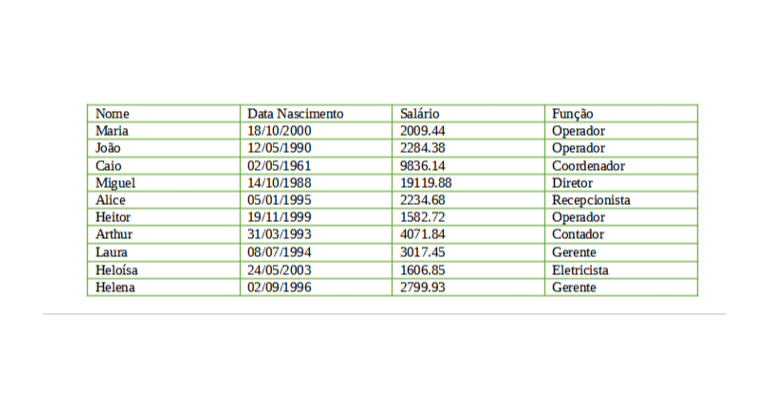

<h1 align="center" style="margin-bottom: 2.5em; padding: 1em;">Processo Seletivo: Projedata Informática</h1>

Este repositório refere-se ao teste prático, chamado "Teste Mão na massa", onde consiste em manipular um a tabela com informações dos funcionários, simulando um cenário cadastral, onde dados como nome, salário, data de nascimento precisarão ser manipulados. <br>
Optei por criar um arquivo JSON com estas informações, para facilitar a interação e manipulação em dicionários (HashMap). Com isto, consegui criar as chaves (keys) com os nomes dos funcionários, e demais informações cadastrais como valores. <br>
A tabela com os dados seria a contida na imagem abaixo:



Abaixo, uma melhor transcrição do que será encontrando este repositório em Java:

<h2>Questão 01 - Criar Classe "Pessoas"</h2>

Neste processo, ocorreu de forma simples, criando um pacote contendo a Classe Pessoas, e seus atributos, que optei por implementar os parâmetros de `GET` e `SET` para solicitar e inserir valores. Desta forma, o trecho do código contido no arquivo [/Pessoas/Pessoas.java](/Pessoas/Pessoas.java) ficou da seguinte forma:

```java
package Pessoas;

import java.time.LocalDate;

public class Pessoas {

     private String Nome = new String();
     private LocalDate DataNascimento;

     public String getNome() {

          return this.Nome;
     }

     public LocalDate getDataNascimento() {
          return this.DataNascimento;
     }

     public void setNome(String nome) {
          this.Nome = nome;
     }

     public void setDataNascimento(LocalDate dataNascimento) {
          this.DataNascimento = dataNascimento;
     }
}
```

Para esta questão, foi solicitado a criação dos seguintes atributos:
- Nome: no tipo `String`;
- Data de Nascimento: no tipo `LocalDate`.

<h2>Questão 02 - Criar Classe "Funcionários" estendida da Classe "Pessoas"</h2>

De igual modo, neste processo, optei por efetuar a criação de um pacote contendo a Classe "Funcionários", sendo estendida da Classe "Pessoas", contendo os mesmos parâmetros de `GET` e `SET`, no arquivo [/Funcionarios/Funcionarios.java](/Funcionarios/Funcionarios.java). <br>
Os atributos a serem inseridos nesta classe seriam a adição do salário e função, sendo:

- Salário: no tipo `BigDecimal`;
- Função: no tipo `String`.

E também ser inserido uma mensagem a ser retornado.

```java
package Funcionarios;

import JSONDadosFuncionarios.DicionarioFuncionarios;
import Pessoas.Pessoas;

import java.math.BigDecimal;

public class Funcionarios extends Pessoas {

     private BigDecimal Salario = new BigDecimal(0);
     private String Funcao = new String();

     public void Funcionarios(String[] args) {

          System.out.println("Alguma coisa a ser retornado");
     }

     public BigDecimal getSalario() {
          return this.Salario;
     }

     public String getFuncao() {
          return this.Funcao;
     }

     public void setSalario(BigDecimal salario) {
          this.Salario = salario;
     }

     public void setFuncao(String funcao) {
          this.Funcao = funcao;
     }
}
```

<h2>Questão 03 - Manipular as informações dos funcionários</h2>

Nesta terceira etapa do teste prático, as manipulações a serem executadas seriam para basicamente efetuar a extração de dados/informações, como:

- Agrupamento dos funcionários por função;
- Validar a idade dos funcionários, e assuntos relacionados;
- Atualização salarial;
- Dentre outros, mais detalhados abaixo.

<h3>3.1 - Inserir os funcionários com as suas informações na mesma ordem da tabela</h3>

Para este processo, optei por efetuar a criação de um diconário (HashMap), importando as informações do arquivo JSON criado, o qual segue a mesma ordem descrita na tabela. Para respeitar a ordem dos dados em que serão apresentadas no processo de iteração, conforme o laço de repetição recebia cada índice, optei por utilizar `LinkedHashMap`, o qual irá efetuar o "link" com os dados recebido com o local da memória destinado àquele índice do dicionário. Para maiores informações, o arquivo [/Funcionarios/FuncionariosRelacao.java](/Funcionarios/FuncionariosRelacao.java). Desta forma, a criação do dicionário ficou da seguinte forma:

```java
private HashMap<String, Map<String, Object>> funcionariosRelacao = new LinkedHashMap<>();
```

Com o intuito de tornar os laços de repetição com maior facilidade de manipulação, para utilizar `ForEach`, sem a necessidade de "transofrmar" o dicionário em uma "lista", utilizei o atributo `Entry` do HashMap e Map.

```java
for (Map.Entry<String, Map<String, String>> f : funcionarios.entrySet()) {

     Funcionarios cadastrarFuncionario = new Funcionarios();

     cadastrarFuncionario.setNome(f.getKey());
     cadastrarFuncionario.setDataNascimento(LocalDate.parse(f.getValue().get("Data Nascimento"), DateTimeFormatter.ofPattern("yyyy-MM-dd")));
     cadastrarFuncionario.setSalario(new BigDecimal(f.getValue().get("Salário")));
     cadastrarFuncionario.setFuncao(f.getValue().get("Função"));

     funcionariosRelacao.put(
               cadastrarFuncionario.getNome(),
               Map.of(
                         "Data Nascimento", cadastrarFuncionario.getDataNascimento(),
                         "Salário", cadastrarFuncionario.getSalario(),
                         "Função", cadastrarFuncionario.getFuncao()
               )
     );
}
```

<h3>3.2 - Remover o funcionário João</h3>

Neste processo, para uma melhor organização, efetuei a criação da classe `FuncionariosRemoverFuncionario`, a qual receberá o dicionário de funcionários, e a string com o nome da chave a ser removida, uma vez que tornei o nome de cada funcionário as chaves do Map, e com isto, retorna o próprio diconário recebido nos parâmetros da classe. <br>
Desta forma, aplico o novo dicionário à variável criada no arquivo "Principal". Para maiores informações poderá conferir o arquivo [/Funcionarios/FuncionariosRemoverFuncionario.java](/Funcionarios/FuncionariosRemoverFuncionario.java).

```java
public class FuncionariosRemoverFuncionario {

     public HashMap<String, Map<String, Object>> FuncionariosRemoverFuncionario(HashMap<String, Map<String, Object>> Funcionarios, String NomeDoFuncionario) {

          for (Map.Entry<String, Map<String, Object>> funcionario : Funcionarios.entrySet()) {

               if (funcionario.getKey().equals(NomeDoFuncionario)) {
                    Funcionarios.remove(funcionario.getKey());
                    break;
               }
          }

          return Funcionarios;
     }
}
```

<h3>3.3 - Exibir todas as informações dos funcionários formatados</h3>

As informações dos funcionários, deverão ser exibidas de maneira formatada, para os seguintes critérios:

- Data de nascimento no formato "dd/mm/aaaa";
- Salário no padrão numérico brasileiro, com o separador de milhar por ponto e decimal por vírgula.

Optei então, por este processo efetuar a criação da classe `FuncionariosExibirInformacoesFormatadas`, a qual irá exibir cada funcionário do dicionário conforme o percorre, restringindo apenas à exibição do nome, data de nascimento e valor salarial. Com isto, temos o seguinte resultado:

```java
public class FuncionariosExibirInformacoesFormatadas {

     public FuncionariosExibirInformacoesFormatadas(HashMap<String, Map<String, Object>> Funcionarios) {

          for (Map.Entry<String, Map<String, Object>> funcionario : Funcionarios.entrySet()) {

               System.out.printf(
                         "Nome: %s | Data Nascimento: %s | Salário: R$ %s \n",
                         funcionario.getKey(),
                         DateTimeFormatter.ofLocalizedDate(FormatStyle.FULL).format((TemporalAccessor) funcionario.getValue().get("Data Nascimento")),
                         NumberFormat.getNumberInstance(new Locale("pt", "BR")).format(funcionario.getValue().get("Salário"))
               );
          }
     }
}
```

O grande destaque seria a formatação da data de nascimento, a qual segui o padrão de dia/mês/ano, apenas de forma mais verbosa. Isto seria uma opção pela função `DateTimeFormatter.ofLocalizedDate(FormatStyle.FULL).format((TemporalAccessor)`, onde:

- ofLocalizedDate realiza a formatação da data com base da sua localidade;
- FormatStyle.FULL seria o parâmetro da função ofLocalizedDate para determinar o estilo de formatação; 
- format((TemporalAccessor) seria a função a receber o texto para formatação, onde, TemporalAccessor seria o acesso ao objeto em questão, com o intuito de faclitar acesso a dados de data, uma vez que o formato enviado seria "yyyy-MM-dd".

<h3>3.4 - Atualização salarial em 10%</h3>

Para a atualização cadastral, executei o processo simples criando a classe `FuncionariosESeusSalarios`, onde:

- Efetuo o envio do dicionário contendo os dados dos funcionários;
- Percorrído o índice do dicionário, a chave de data iteração crio um laço de repetição, onde, alimento num dicionário temporário os novos dados (basicamente o salário atualizado), e após, executo um update na chave, que seria o nome dos funcionários.

```java
private void AumentoSalarial(HashMap<String, Map<String, Object>> Funcionarios, Double PercentualAumento) {

     for (HashMap.Entry<String, Map<String, Object>> funcionario : Funcionarios.entrySet()) {

          System.out.printf("Nome: %s | ", funcionario.getKey());

          Map<String, Object> dadosTemporariosAtualizados = new HashMap<>();

          for (Map.Entry<String, Object> funcionarioDados : funcionario.getValue().entrySet()) {

               switch (funcionarioDados.getKey()) {

                    case "Data Nascimento":
                         dadosTemporariosAtualizados.put("Data Nascimento", funcionarioDados.getValue());

                         break;
                    case "Salário":
                         BigDecimal salarioAntigo = new BigDecimal(funcionarioDados.getValue().toString());
                         BigDecimal salarioAtualizado = salarioAntigo.multiply(BigDecimal.valueOf(PercentualAumento));

                         System.out.printf("Salário antigo: %.2f, Salário novo: %.2f \n", salarioAntigo, salarioAtualizado);

                         dadosTemporariosAtualizados.put("Salário", salarioAtualizado);

                         break;
                    case "Função":
                         dadosTemporariosAtualizados.put("Função", funcionarioDados.getValue());

                         break;
               }
          }

          funcionario.setValue(dadosTemporariosAtualizados);

          this.funcionariosComAumentoSalarial.put(funcionario.getKey(), funcionario.getValue());
     }
}
```

Aproveitei também para concentrar nesta classe os assuntos relacionados aos salários, com suas somas, e médias por sálário mínimo.

<h3>3.5 & 3.6 - Agrupar os funcionários por função, e exibí-los</h3>

Nesta etapa, criei o Map, conforme solicitado, contendo como chave o nome das funções, e valor, a lista dos funcionários correspondentes. Desta forma, o que executei nesta etapa, foi:

- Percorrer o dicionário, extraindo o nome das funções dos funcionários, e criando uma listagem com estes dados;
  - Através do método `contains()` garanti que os dados não fossem repetidos;
- Após, com a listagem criada, percorri cada um de seus índices, e validei quais funcionários eram correspondentes, criando então a lsitagem temporária com os seus nomes, e alimentando o Map ao final de cada etapa do laço.

Com isto, aproveitei para já exibir os resultados formatados na própria função desta classe criada.<br>
Para maiores informações, consultar o arquivo [/Funcionarios/FuncionariosAgrupadosPorFuncao.java](/Funcionarios/FuncionariosAgrupadosPorFuncao.java).

<h3>3.8 - Exibir os funcionários com nascimento nos meses 10 e 12</h3>

No questionário, o item 3.7 não existe.

Todos os assuntos relacionados à idade e data de nascimento, foram concentrados na classe `FuncionariosIdadeDoFuncionario`. Neste caso, os funcionários com nascimento em Outubro e Dezembro, foram apurados pelo método `MesDeNascimentoDoFuncionario()`, o qual recebe o dicionário dos funcionários apenas com nome e nascimento, e uma lista dos meses a serem validados. Para inserir e obter o retorno será través dos métodos `GET` e `SET`.

```java
public List<String> getListaDosMesesDeNascimento() {
     return MesDeNascimentoDoFuncionario(dicionarioTemporarioComDataDeNascimentoDosFuncionarios, this.ListaDosMesesDeNascimento);
}

public void setListaDosMesesDeNascimento(List<Integer> listaDosMesesDeNascimento) {
     this.ListaDosMesesDeNascimento = listaDosMesesDeNascimento;
}

private List<String> MesDeNascimentoDoFuncionario(HashMap<String, LocalDate> Funcionarios, List<Integer> listaDosMesesDeNascimento) {

     List<String> nomeDosFuncionariosNoMesDeNascimentoSolicitado = new ArrayList<>();

     for (Map.Entry<String, LocalDate> funcionario : Funcionarios.entrySet()) {

          if (listaDosMesesDeNascimento.contains(
                    LocalDate.parse(funcionario.getValue().toString(), formatarData).getMonthValue()
          )) {
               nomeDosFuncionariosNoMesDeNascimentoSolicitado.add(funcionario.getKey());
          }
     }

     return nomeDosFuncionariosNoMesDeNascimentoSolicitado;
}
```

Para maiores informações, consultar o arquivo [/Funcionarios/FuncionariosIdadeDoFuncionario.java](/Funcionarios/FuncionariosIdadeDoFuncionario.java)

<h3>3.9 - Exibir o funcionário com maior idade</h3>

Uma vez que se faz necessário exibir o nome e idade do funcionário mais velho, nesta classe, criei um método o qual irá apurar a idade de todos os funcionários, e exibí-las. Após, um outor método irá validar o nome do funcionário mais velho, e o retornar numa string. De todo o modo, a solicitação da questão encontra-se atendida.

Na validação do funcionário mais velho, recorri ao processo simples, de instanciar uma variável para armazenar a idade, e a iniciei zerada, e após, cada iteração do laço, validava se referia a um valor maior que o anterior.

```java
private void FuncionarioMaisVelho(HashMap<String, Integer> Funcionarios) {

     Integer idadeFuncionarioMaisVelho = 0;
     String nomeDoFuncionarioMaisVelho = new String();

     for (Map.Entry<String, Integer> funcionario : Funcionarios.entrySet()) {

          if (funcionario.getValue() > idadeFuncionarioMaisVelho) {

               idadeFuncionarioMaisVelho = funcionario.getValue();
               nomeDoFuncionarioMaisVelho = funcionario.getKey();
          }
     }

     this.FuncionarioMaisVelho = nomeDoFuncionarioMaisVelho;
}
```

Para maiores informações, consultar o arquivo [/Funcionarios/FuncionariosIdadeDoFuncionario.java](/Funcionarios/FuncionariosIdadeDoFuncionario.java)

<h3>3.10 - Exibir os nomes dos funcionários em ordem alfabética</h3>

Resumidamente, uma vez que se faz necessário apenas exibir a listagem das chaves, sendo os nomes dos funcionários, alfabeticamente, optei por executar na própria classe Principal, utilizando os métodos para extrair as chaves, ordenação, e impressão.

```java
funcionarios.keySet().stream().sorted().forEach(nomeDoFuncionario -> System.out.printf("%s | ", nomeDoFuncionario));
```

<h3>3.11 - Exibir a soma total dos salários dos funcionários</h3>

Resumidamente, uma vez que a apuração destes dados já encontram-se inseridos na classe `FuncionariosESeusSalarios`, apenas invoquei o método que irá retornar a soma destes resultados.
Para maiores informações, consultar o arquivo [/Funcionarios/FuncionariosESeusSalarios.java](/Funcionarios/FuncionariosESeusSalarios.java).

<h3>3.12 - Média de Salário Mínimo por funcionário</h3>

Nesta última etapa, foi solicitado para efetuar o cálculo da média de quantos salários mínimos cada funcionário recebe, considerando o valor de R$ 1212,00 (para o mínimo). Desta forma, utilizando a mesma classe relacionada ao tratamento dos salários, percorri o dicionário dos funcionários e efetuei a extração correspondente ao valor salarial, e o dividi pela quantidade do mínimo. <br>
Após, pelo método `getfuncionariosComMediasDeSalarioMinimo` é possível obter este resultado.

Para maiores informações, consultar o arquivo [/Funcionarios/FuncionariosESeusSalarios.java](/Funcionarios/FuncionariosESeusSalarios.java).
